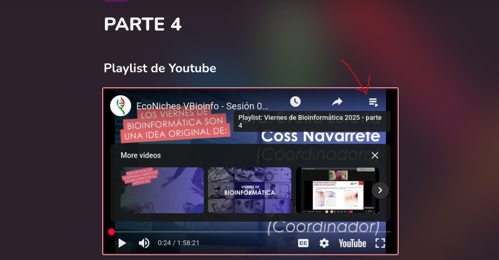

# PARTE 4

## Playlist de Youtube

<iframe width="560" height="315" src="https://www.youtube.com/embed/videoseries?si=m565kdBgDtP81P6u&amp;list=PL2lp2OS8ujcXJxny-K3sAn-OmDO7HIcHF" title="YouTube video player" frameborder="0" allow="accelerometer; autoplay; clipboard-write; encrypted-media; gyroscope; picture-in-picture; web-share" referrerpolicy="strict-origin-when-cross-origin" allowfullscreen></iframe>

### Viernes 1. (5/sep/2025) **Leaving Academia 1**\
    
  - 11:30 a 12:30 - Información general del curso - Evelia Coss e Israel Aguilar\
  
  - 12:30 a 13:30 - Leaving Academia - Mi camino profesional tras dejar la academia - Emmanuel Rojas Morales

    <iframe width="560" height="315" src="https://www.youtube.com/embed/oTxPMBZpoVM?si=r_opk3PIvxbySoKI" title="YouTube video player" frameborder="0" allow="accelerometer; autoplay; clipboard-write; encrypted-media; gyroscope; picture-in-picture; web-share" referrerpolicy="strict-origin-when-cross-origin" allowfullscreen></iframe>

### Viernes 2. (12/sep/2025) **Leaving Academia 2**\
    
  - 11:30 a 12:30 - Leaving Academia - Mi camino profesional tras dejar la academia - Antonio Martínez Gutiérrez\
  - 12:30 a 13:30 - La IA como herramienta de programación: chatGPT - Israel Aguilar

    <iframe width="560" height="315" src="https://www.youtube.com/embed/QecmDe8UVHE?si=bRhylaLV5tnsj2hH" title="YouTube video player" frameborder="0" allow="accelerometer; autoplay; clipboard-write; encrypted-media; gyroscope; picture-in-picture; web-share" referrerpolicy="strict-origin-when-cross-origin" allowfullscreen></iframe>

### Viernes 3. (19/sep/2025) **PLINK**\
    
  - 11:30 a 13:30 - Preparación de data para GWAS - Angélica de Luna García

    Artículo recomendado: [A tutorial on conducting genome‐wide association studies: Quality control and statistical analysis](https://pmc.ncbi.nlm.nih.gov/articles/PMC6001694/)\
    Datos descargables para el ejercicio: <https://github.com/MareesAT/GWA_tutorial/>\
    Notas de la profesora: <https://docs.google.com/document/d/1ueirFtDEdG4hUMMWLL_69VT9YfMi2dvd_az1WFrUsH4/edit?usp=sharing>

    <iframe width="560" height="315" src="https://www.youtube.com/embed/58dZVEAN7iE?si=rtb74KUUWuM5mrTo" title="YouTube video player" frameborder="0" allow="accelerometer; autoplay; clipboard-write; encrypted-media; gyroscope; picture-in-picture; web-share" referrerpolicy="strict-origin-when-cross-origin" allowfullscreen></iframe>

### Viernes 4. (26/sep/2025) **Leaving Academia 3**\
    
  - 11:30 a 12:30 - Leaving Academia - Mi camino profesional tras dejar la academia - María Guadalupe Segovia Ramírez\
    
  - 12:30 a 13:30 - Proyectos de la Comunidad - Evelia Coss 12:30 - [Dr. Diego Cortez Quezada](https://www.ccg.unam.mx/diego-cortez-quezada/), investigador de CCG

    <iframe width="560" height="315" src="https://www.youtube.com/embed/k2U24cPQeCk?si=VievUB3dmt4rX0rd" title="YouTube video player" frameborder="0" allow="accelerometer; autoplay; clipboard-write; encrypted-media; gyroscope; picture-in-picture; web-share" referrerpolicy="strict-origin-when-cross-origin" allowfullscreen></iframe>

### Viernes 5. (03/oct/2025) - **Clasificación con abundancia taxonómica**\
    
  - 11:30 a 13:30 - Clasificando microbios: una introducción al microbioma y al aprendizaje supervisado - Brenda Eloisa Sanchez Pichardo

    -   Link a notebook: <https://drive.google.com/drive/folders/1zt35oBBHiEpDtJd0VjgntP9vihuOcPlN?usp=share_link>

    <iframe width="560" height="315" src="https://www.youtube.com/embed/hNDk899RrME?si=i5KTSExV3OiqfBBS" title="YouTube video player" frameborder="0" allow="accelerometer; autoplay; clipboard-write; encrypted-media; gyroscope; picture-in-picture; web-share" referrerpolicy="strict-origin-when-cross-origin" allowfullscreen></iframe>

### Viernes 6. (10/oct/2025) - **PCA en Transcriptómica**\
    
  - 11:30 a 13:30 - Anáisis de Componentes Principales en datos Transcriptómicos - Alejandra Paulina Pérez González

    -   Link a script de la clase: <https://raw.githubusercontent.com/VieRnesBioinformatica/ViernesBioinfo2025_parte4/refs/heads/main/scripts/PCA.R>

    <iframe width="560" height="315" src="https://www.youtube.com/embed/Pkiwttdjt4k?si=YThokLMru7KzzyG9" title="YouTube video player" frameborder="0" allow="accelerometer; autoplay; clipboard-write; encrypted-media; gyroscope; picture-in-picture; web-share" referrerpolicy="strict-origin-when-cross-origin" allowfullscreen></iframe>

### Viernes 7. (17/oct/2025) - **Reproducibilidad Bioinformática**\
    
  - 11:30 a 13:30 - Recreando una figura de un artículo en R - Josué Guzmán Linares

    Link a scripts de la clase:

    -   <https://raw.githubusercontent.com/VieRnesBioinformatica/ViernesBioinfo2025_parte4/refs/heads/main/scripts/nyt_heatmap.R>

    -   <https://raw.githubusercontent.com/VieRnesBioinformatica/ViernesBioinfo2025_parte4/refs/heads/main/scripts/tidyheatmap.R>

    <iframe width="560" height="315" src="https://www.youtube.com/embed/G9muqbL8zvM?si=BndkhhJki1wwCK3q" title="YouTube video player" frameborder="0" allow="accelerometer; autoplay; clipboard-write; encrypted-media; gyroscope; picture-in-picture; web-share" referrerpolicy="strict-origin-when-cross-origin" allowfullscreen></iframe>

### Viernes 8. (24/oct/2025) - **Predicción miRNAs**\
    
  - 11:30 a 13:30 - Predicción de genes blanco y vías funcionales en miRNAs - Andrea Maria Torres Iribe

  - Link a scripts de la clase:

    -   <https://raw.githubusercontent.com/VieRnesBioinformatica/ViernesBioinfo2025_parte4/refs/heads/main/scripts/clase_mirna_script_21_10_25.R>

    <iframe width="560" height="315" src="https://www.youtube.com/embed/zRxpl8dvISA?si=HlS2-snX00_TNzfG" title="YouTube video player" frameborder="0" allow="accelerometer; autoplay; clipboard-write; encrypted-media; gyroscope; picture-in-picture; web-share" referrerpolicy="strict-origin-when-cross-origin" allowfullscreen></iframe>

### Viernes 9. (31/oct/2025) - Diferentes caminos para hacer Bioinformática\
    
  - 11:30 a 13:30 - Proyectos de la Comunidad - Israel Aguilar

    <iframe width="560" height="315" src="https://www.youtube.com/embed/xx0puRaEx18?si=eUeYhOmGRg49Kp-_" title="YouTube video player" frameborder="0" allow="accelerometer; autoplay; clipboard-write; encrypted-media; gyroscope; picture-in-picture; web-share" referrerpolicy="strict-origin-when-cross-origin" allowfullscreen></iframe>

### Viernes 10. (07/nov/2025) - Creación de gráficos con ggplot2\
    
  - 11:30 a 13:30 - Creación de gráficos con ggplot2 - Fernanda Mirón Toruño

  - Link a scripts de la clase:

    -   <https://raw.githubusercontent.com/fernanda-miron/Viernes-de-Bioinformatica/refs/heads/main/ggplot2_script.R>

    <iframe width="560" height="315" src="https://www.youtube.com/embed/Ec8fub7IJE8?si=olfIJx76Y55f9EKl" title="YouTube video player" frameborder="0" allow="accelerometer; autoplay; clipboard-write; encrypted-media; gyroscope; picture-in-picture; web-share" referrerpolicy="strict-origin-when-cross-origin" allowfullscreen></iframe>

### Viernes 13. (28/nov/2025) - **Llamado de Variantes Quick**\
  - 11:30 a 13:30 - Tutorial nf-core/sarek - Karla Guzmán Barrenechea

    <iframe width="560" height="315" src="https://www.youtube.com/embed/TKv8roQdltU?si=tKpllYA4w9tEbrEC" title="YouTube video player" frameborder="0" allow="accelerometer; autoplay; clipboard-write; encrypted-media; gyroscope; picture-in-picture; web-share" referrerpolicy="strict-origin-when-cross-origin" allowfullscreen></iframe>

### Viernes 14. TBA (05/dic/2025) - **¡Cómo preparar tus bases de datos!**\
    
  - 11:30 a 13:30 - Preparing databases for mapping and variant calling in cancer research - Alan Michael Torres Calderon

  - Link a scripts y documentación de la clase:

    -   <https://github.com/mike-bioinfo/tutorial-databases-cancer>

    <iframe width="560" height="315" src="https://www.youtube.com/embed/cTbxCiuJgv4?si=0OqwjFpNjobzpJbZ" title="YouTube video player" frameborder="0" allow="accelerometer; autoplay; clipboard-write; encrypted-media; gyroscope; picture-in-picture; web-share" referrerpolicy="strict-origin-when-cross-origin" allowfullscreen></iframe>
-   Viernes 15. TBA (12/dic/2025) - **EcoNiches**\
    11:30 a 13:30 - Tutorial del paquete R: EcoNiches - Armando Sunny

    <iframe width="560" height="315" src="https://www.youtube.com/embed/XOnm1B019Q4?si=g69NLgekM_6VXUl9" title="YouTube video player" frameborder="0" allow="accelerometer; autoplay; clipboard-write; encrypted-media; gyroscope; picture-in-picture; web-share" referrerpolicy="strict-origin-when-cross-origin" allowfullscreen></iframe>