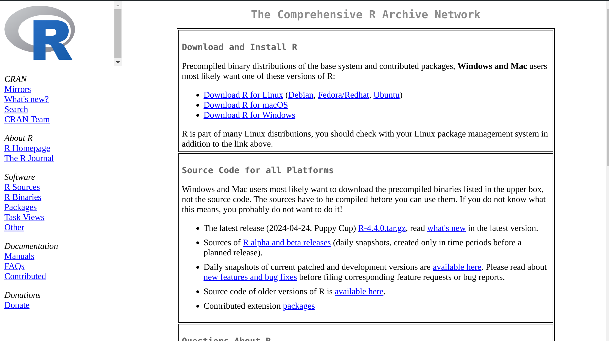

Lo primero que tenemos que hacer es ir a la pagina de [CRAN](https://cran.r-project.org/) y seleccionar la descarga dependiendo nuestro sistema operativo.




## Linux (Ubuntu)

Lo primero que vamos a hacer es abrir nuestra terminal ```Ctrl + Alt + T``` y vamos a ver el inicio asi:


Después en este espacio escribimos lo siguiente (Probablemente te pida contraseña, es tu computadora pidiéndote permisos para crear y modificar archivos):

```bash
# Actualizar indices del sistema
sudo apt update -qq
# Instalar unos paquetes
sudo apt install --no-install-recommends software-properties-common dirmngr
# Añadir una clave de acceso para descargar R
wget -qO- https://cloud.r-project.org/bin/linux/ubuntu/marutter_pubkey.asc | sudo tee -a /etc/apt/trusted.gpg.d/cran_ubuntu_key.asc
# Añadir el repositorio de R desde CRAN
sudo add-apt-repository "deb https://cloud.r-project.org/bin/linux/ubuntu $(lsb_release -cs)-cran40/"
# Despues ejecutamos la orden de instalar R
sudo apt install --no-install-recommends r-base
# Por ultimo instalamos mas de 5000 paquetes de CRAN
sudo add-apt-repository ppa:c2d4u.team/c2d4u4.0+
```

Listo, ya tienes R en Linux Ubuntu, si sabes como instalarlo en otra distribución puedes mandar tu aportación a mi correo (<jasvpj@gmail.com>)

## Windows

Descarga con este enlace el [ejectuable](https://cran.r-project.org/bin/windows/base/R-4.4.0-win.exe) y sigue la guia de instalación.



## Mac OS


### M1-3 Macs

Descarga con este enlace el [ejectuable](https://cran.r-project.org/bin/macosx/big-sur-arm64/base/R-4.4.0-arm64.pkg) y sigue la guia de instalación.

### Intel Macs

Descarga con este enlace el [ejectuable](https://cran.r-project.org/bin/macosx/big-sur-x86_64/base/R-4.4.0-x86_64.pkg) y sigue la guia de instalación.

