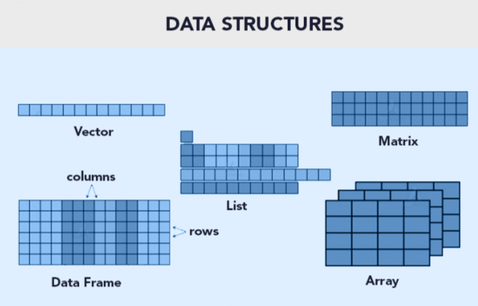

Vector y dataframe.

## Paquetes Necesarios

``` r
install.packages("rmarkdown")
install.packages("dplyr")
install.packages("reshape2")
install.packages("remotes")
```

# Estructura de Datos/Tipos de Datos

## Existen 5 estructuras de datos en R

Las estructuras de datos son objetos que contienen datos. Cuando trabajamos con R, lo que estamos haciendo es manipular estas estructuras.

| TIpo      | Declaracion de la variable                    | Conversion       | Dimensiones | Contenido   |
|--------------|--------------|--------------|--------------|--------------|
| Vector    | `c(), seq(), rep(), valorI:valorN; seq_len()` | `as.vector()`    | 1           | homogenea   |
| Lists     | `list()`                                      | `as.list()`      | 1\*         | homogenea   |
| Matrix    | `matrix(valores, nrow = x, ncol = y)`         | `as.matrix()`    | 2           | heterogenea |
| Dataframe | `data.frame()`                                | `as.dataframe()` | 2           | heterogenea |

Tambien estan los `array` pero son poco usados en R.

Para conocer la estructura del archivo debes usar `str()`.

Una lista puede contener matrices en su interior, vectores, funciones, etc.



| Clases    | Declaración de la variable | Conversión de formato | Reglas                                                                                                        |
|--------------|--------------|--------------|-------------------------------|
| numeric   | `numeric()`                | `as.numeric()`        | FALSE -\> 0, TRUE -\> 1; "1", "2", ... -\> 1,2, ...; "A" -\> NA                                               |
| integer   | `integer()`                | `as.integer()`        | FALSE -\> 0, TRUE -\> 1; "1", "2", ... -\> 1,2, ...; "A" -\> NA                                               |
| double    | `double()`                 | `as.double()`         |                                                                                                               |
| character | `character()`              | `as.character()`      | 1,2, ... -\> "1", "2", ...; FALSE -\> "FALSE"; TRUE -\> "TRUE"                                                |
| logical   | `logical()`                | `as.logical()`        | 0 -\> FALSE, other numbers -\> TRUE; ("FALSE", "F") -\> FALSE; ("TRUE", "T") -\> TRUE, other character -\> NA |
| factor    | `factor()`                 | `as.factor()`         |                                                                                                               |

Si queremos saber la clase de la variable debemos usar `class()`, aunque tambien `str()` te dice esta información.

> NOTA: `as.integer()` convierte los numeros a enteros. Ejemplo: as.integer(2.5) = 2. En cambio, `as.double()` permite que los numeros contengan decimales.

## **Recordatorio: Operadores**

| Aritméticos             | Comparación            | Argumentos lógicos (Logical Operators) |
|--------------------|--------------------|--------------------------------|
| `+` Adición / suma      | `<` Menor que          | `!x` - Not x (logical NOT)             |
| `-` Sustracción / resta | `>` Mayor que          | `x & y` OR `x AND y` - (logical AND)   |
| `*` Multiplicación      | `<=` Menor o igual que | `x && y` - identico                    |
| `/` OR %% División      | `>=` Mayor o igual que | `xor(x,y)` Funcion OR                  |
| `^` OR \*\* Exponencial | `==` Igual a           | `%in%` pertenece a                     |
| `%/%` División integral | `!=` Diferente de      |                                        |

Otra forma de escrir OR es `x | y` OR `x || y`.

## **Jerarquía de operaciones**

En R, al igual que en matemáticas, las operaciones tienen un orden de evaluación definido.

Cuanto tenemos varias operaciones ocurriendo al mismo tiempo, en realidad, algunas de ellas son realizadas antes que otras y el resultado de ellas dependerá de este orden.

| Orden | Operadores        |
|-------|-------------------|
| 1     | `^`               |
| 2     | `* /`             |
| 3     | `+ -`             |
| 4     | `< > <= >= == !=` |
| 5     | `!`               |
| 6     | `&`               |
| 7     | OR                |

# **Manipulación de datos con R base (vector y dataframe)**

## **Vector: Formas de declarar un vector**

```R         
# Declarar el vector con 5 posiciones (del 1 al 5)


\# Opcion A - c()

x \<- c(1,2,3,4,5)

\# Opcion B - valorI:valorN

x \<- 1:5

x

\# [1] 1 2 3 4 5

\# Opcion C - seq(inicio, final)

x \<- seq(1,5) \#

x

\# [1] 1 2 3 4 5

\# Opcion D -seq_len(final)

x \<- seq_len(5)

x

\# [1] 1 2 3 4 5

\# Opcion E - rep(valor, veces)

y \<- c(rep(1,5), rep(c(3,5),5))

y

**\# [1] 1 1 1 1 1 3 5 3 5 3 5 3 5 3 5**
```

## **Vector: Estructura y clases de variables**

Conocer la estructura de un vector mediante la función `str()`. El vector es de tipo `integer` y va de 1 a 5.

```R         
str(x)


\# int [1:5] 1 2 3 4 5
```
Para solo ver el tipo usamos la función `class()`

```R        
class(x)


\# [1] "integer"
```