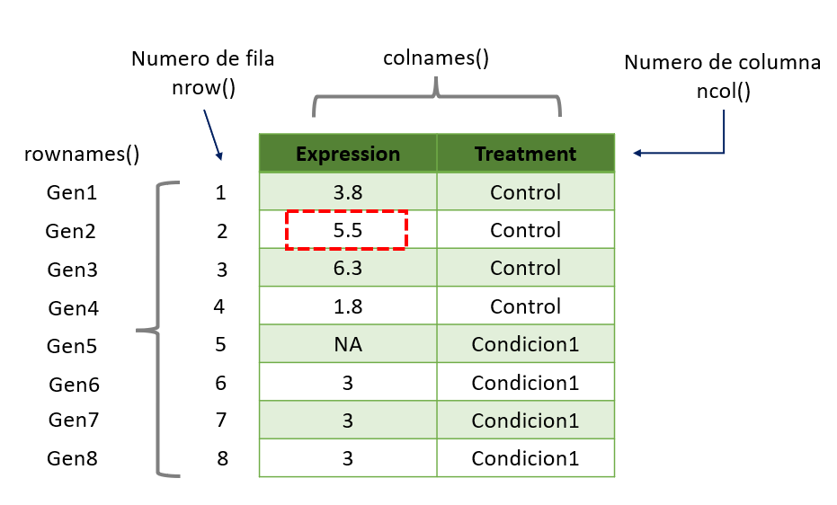

Vector y dataframe.

## Paquetes Necesarios

``` r
install.packages("rmarkdown")
install.packages("dplyr")
install.packages("reshape2")
install.packages("remotes")
```

# Estructura de Datos/Tipos de Datos

## Existen 5 estructuras de datos en R

Las estructuras de datos son objetos que contienen datos. Cuando trabajamos con R, lo que estamos haciendo es manipular estas estructuras.

| TIpo      | Declaracion de la variable                    | Conversion       | Dimensiones | Contenido   |
|---------------|---------------|---------------|---------------|---------------|
| Vector    | `c(), seq(), rep(), valorI:valorN; seq_len()` | `as.vector()`    | 1           | homogenea   |
| Lists     | `list()`                                      | `as.list()`      | 1\*         | homogenea   |
| Matrix    | `matrix(valores, nrow = x, ncol = y)`         | `as.matrix()`    | 2           | heterogenea |
| Dataframe | `data.frame()`                                | `as.dataframe()` | 2           | heterogenea |

Tambien estan los `array` pero son poco usados en R.

Para conocer la estructura del archivo debes usar `str()`.

Una lista puede contener matrices en su interior, vectores, funciones, etc.


| Clases    | Declaración de la variable | Conversión de formato | Reglas                                                                                                        |
|------------------|------------------|------------------|--------------------|
| numeric   | `numeric()`                | `as.numeric()`        | FALSE -\> 0, TRUE -\> 1; "1", "2", ... -\> 1,2, ...; "A" -\> NA                                               |
| integer   | `integer()`                | `as.integer()`        | FALSE -\> 0, TRUE -\> 1; "1", "2", ... -\> 1,2, ...; "A" -\> NA                                               |
| double    | `double()`                 | `as.double()`         |                                                                                                               |
| character | `character()`              | `as.character()`      | 1,2, ... -\> "1", "2", ...; FALSE -\> "FALSE"; TRUE -\> "TRUE"                                                |
| logical   | `logical()`                | `as.logical()`        | 0 -\> FALSE, other numbers -\> TRUE; ("FALSE", "F") -\> FALSE; ("TRUE", "T") -\> TRUE, other character -\> NA |
| factor    | `factor()`                 | `as.factor()`         |                                                                                                               |

Si queremos saber la clase de la variable debemos usar `class()`, aunque tambien `str()` te dice esta información.

> NOTA: `as.integer()` convierte los numeros a enteros. Ejemplo: as.integer(2.5) = 2. En cambio, `as.double()` permite que los numeros contengan decimales.

## **Recordatorio: Operadores**

| Aritméticos             | Comparación            | Argumentos lógicos (Logical Operators) |
|---------------------|--------------------|-------------------------------|
| `+` Adición / suma      | `<` Menor que          | `!x` - Not x (logical NOT)             |
| `-` Sustracción / resta | `>` Mayor que          | `x & y` OR `x AND y` - (logical AND)   |
| `*` Multiplicación      | `<=` Menor o igual que | `x && y` - identico                    |
| `/` OR %% División      | `>=` Mayor o igual que | `xor(x,y)` Funcion OR                  |
| `^` OR \*\* Exponencial | `==` Igual a           | `%in%` pertenece a                     |
| `%/%` División integral | `!=` Diferente de      |                                        |

Otra forma de escrir OR es `x | y` OR `x || y`.

## **Jerarquía de operaciones**

En R, al igual que en matemáticas, las operaciones tienen un orden de evaluación definido.

Cuanto tenemos varias operaciones ocurriendo al mismo tiempo, en realidad, algunas de ellas son realizadas antes que otras y el resultado de ellas dependerá de este orden.

| Orden | Operadores        |
|-------|-------------------|
| 1     | `^`               |
| 2     | `* /`             |
| 3     | `+ -`             |
| 4     | `< > <= >= == !=` |
| 5     | `!`               |
| 6     | `&`               |
| 7     | OR                |

# **Manipulación de datos con R base (vector y dataframe)**

## **Vector: Formas de declarar un vector**

``` r
# Declarar el vector con 5 posiciones (del 1 al 5)


# Opcion A - c()

x <- c(1,2,3,4,5)

# Opcion B - valorI:valorN

x <- 1:5

x
```

``` r
# Opcion C - seq(inicio, final)

x <- seq(1,5) 

x
```



[1] 1 2 3 4 5



```         
# Opcion D -seq_len(final)

x <- seq_len(5)

x
```



[1] 1 2 3 4 5



``` r
\# Opcion E - rep(valor, veces)

y <- c(rep(1,5), rep(c(3,5),5))

y
```



[1] **1 1 1 1 1 3 5 3 5 3 5 3 5 3 5**



## **Vector: Estructura y clases de variables**

Conocer la estructura de un vector mediante la función `str()`. El vector es de tipo `integer` y va de 1 a 5.

``` r
str(x)
```



int [1:5] 1 2 3 4 5



Para solo ver el tipo usamos la función `class()`

``` r
class(x)
```

## **Ejercicios**

``` r
x <- c(TRUE, TRUE, FALSE, FALSE)
x
```



[1] TRUE TRUE FALSE FALSE



``` r
x <- as.factor(x)
```

Vamos a crear un nuevo vector con los nombres de los participantes a esta clase

``` r
ClaseBioinfo <- c("Jose Luis", "Diego", "Rosita", "Yuri", "Ulises", "Tere", "Chucho")
ClaseBioinfo
```



[1] "Jose Luis" "Diego" "Rosita" "Yuri" "Ulises" "Tere" "Chucho"



``` r
#ver estructura

str(ClaseBioinfo)
```



chr [1:7] "Jose Luis" "Diego" "Rosita" "Yuri" "Ulises" "Tere" "Chucho"



Extraer información

``` r
ClaseBioinfo =="Ulises"
```



[1] FALSE FALSE FALSE FALSE  TRUE FALSE FALSE



``` r
ClaseBioinfo =="Chucho"
```



[1] FALSE FALSE FALSE FALSE FALSE FALSE  TRUE



Cuando son mas de un valor usamos %in%

``` r
ClaseBioinfo %in% c("Ulises", "Chucho")
```



[1] FALSE FALSE FALSE FALSE TRUE FALSE  TRUE



Ahora tambien podemos usar:

``` r
ClaseBioinfo == c("Ulises", "Chucho")
```

Podemos declarar un vector de los tratamientos

``` r
#Opcion A
y <- rep(c("Control", "Condicion"),5)
```



 [1] "Control"   "Condicion" "Control"   "Condicion" "Control"   "Condicion"
 [7] "Control"   "Condicion" "Control"   "Condicion"



``` r
#Opcion B
y <- c(rep("Control",5), rep("Condicion",5))
y
```



 [1] "Control"   "Condicion" "Control"   "Condicion" "Control"   "Condicion"
 [7] "Control"   "Condicion" "Control"   "Condicion"



## **Dataframe**

### **Dataframe: Formas de declarar un vector**

``` r
x <- 1:4
n <- 10
M <- c(10, 35)
y <- 2:4
```

Podemos declarar los componentes de un Dataframe en variables separadas y luego juntarlo o en una sola linea.

``` r
x <- 1:4; n <- 10; M <- c(10, 35); y <- 2:4
```

Vamos a crear dataframes apartir de estos vectores.

```         
data.frame(x,n)
```



#   x  n
# 1 1 10
# 2 2 10
# 3 3 10
# 4 4 10



```         
data.frame(x, M)
```



#   x  M
# 1 1 10
# 2 2 35
# 3 3 10
# 4 4 35



### **Dataframe en una sola linea**

``` r
data.frame(x = 1:4, n = 10)
```



#   x  M
# 1 1 10
# 2 2 10
# 3 3 10
# 4 4 10



``` r
data.frame(x = 1:4, M = c(10,35))
```

## Dataframe: Ejercicio

``` r
data.frame(x, y)
```



# Error in data.frame(x, y) : 
#  arguments imply differing number of rows: 4, 3



> NOTA: El número de filas y columnas debe ser el mismo número. Existen excepciones al usar paquetes como dplyr.

### **Dataframe: Estructura y clases de variables**

Cada columna es una **variable** la cual puede ser de un tipo o clase.

``` r
df <- data.frame(genes = paste0("Gen", seq_len(8)), 
                 expression = c(3.8, 5.5, 6.3, 1.8, 9, rep(3,3)), 
                 treatment =c(rep("Control", 4), rep("Condicion1",4)))
head(df)
```



#   genes expression  treatment
# 1  Gen1        3.8    Control
# 2  Gen2        5.5    Control
# 3  Gen3        6.3    Control
# 4  Gen4        1.8    Control
# 5  Gen5        9.0 Condicion1
# 6  Gen6        3.0 Condicion1



Es un dataframe con 3 variables(genes, expression y treatment) y cada uno tiene su propia clase.

``` r
str(df)
```



# 'data.frame':    8 obs. of  3 variables:
#  $ genes     : chr  "Gen1" "Gen2" "Gen3" "Gen4" ...
#  $ expression: num  3.8 5.5 6.3 1.8 9 3 3 3
#  $ treatment : chr  "Control" "Control" "Control" "Control" ...



### **Dataframe con los datos de la clase**

Vamos a crear un nuevo vector con las edades, llamado `edad`, posteriormente, vamos a combinarlo con el vector que creamos previamente `ClaseBioinfo`

``` r
# declarar un vector e incorporarlo en el dataframe
edad <- c(31,32, 30, 30, 28, 32, 29)
# Almacenar el dataframe
ClaseBioinfo <- data.frame(ClaseBioinfo, edad)
ClaseBioinfo
```



#   ClaseBioinfo edad
# 1    Jose Luis   31
# 2        Diego   32
# 3       Rosita   30
# 4         Yuri   30
# 5       Ulises   28
# 6         Tere   32
# 7       Chucho   29



### Agregar una columna en el dataframe

Tambien podemos agregar nuevas columnas usando el simbolo \$ de la siguiente manera:

``` r
ClaseBioinfo$formacion <- c("medicina", "nutricion", "medicina", 
                            "biologia", "medicina", "medicina", 
                            "biologia")
head(ClaseBioinfo,3)
```



#   ClaseBioinfo edad formacion
# 1    Jose Luis   31  medicina
# 2        Diego   32 nutricion
# 3       Rosita   30  medicina



El dataframe tiene 7 filas y 3 columnas.

``` r
str(ClaseBioinfo)
```



# 'data.frame':    7 obs. of  3 variables:
#  $ ClaseBioinfo: chr  "Jose Luis" "Diego" "Rosita" "Yuri" ...
#  $ edad        : num  31 32 30 30 28 32 29
#  $ formacion   : chr  "medicina" "nutricion" "medicina" "biologia" ...



### Dataframe, completando espacios faltantes

Cuando creamos la columna formacion en el dataframe al contener 9 elementos el dataframe, R repite 3 veces los valores contenidos en la columna `formacion` para llenar los 9 espacios.

``` r
ClaseBioinfo <- c("Jose Luis", "Diego", "Rosita", "Yuri", 
                  "Ulises", "Tere", "Chucho", "Evelia", "Fulanito")
edad <-c(31,32, 30, 30, 28, 32, 29,29,30)
ClaseBioinfo <- data.frame(ClaseBioinfo, edad) # crear dataframe
ClaseBioinfo$formacion <- c("medicina", "nutricion", "medicina")
head(ClaseBioinfo, 3)
```



#   ClaseBioinfo edad formacion
# 1    Jose Luis   31  medicina
# 2        Diego   32 nutricion
# 3       Rosita   30  medicina



### **Ejercicios:**

A partir del siguiente ejemplo, completa los siguientes ejercicios:

``` r
df <- data.frame(genes = paste0("Gen", seq_len(8)), 
                 expression = c(3.8, 5.5, 6.3, 1.8, 9, rep(3,3)), 
                 treatment =c(rep("Control", 4), rep("Condicion1",4)))
```

1.  Convierte la columna 3 perteneciente a tratamiento (treatment) a factor.

> NOTA: En este ejemplo, solo tenemos dos condiciones "Control" y "Condicion1". Por lo que, solo deben hacer dos niveles (levels).

2.  Renombra las filas con los nombres de los genes y elimina la columna 1.

> NOTA: Recuerda que para renombrar las filas es rownames() y las columnas se usa colnames().

#### Respuestas

1.  Modifica la columna 3 perteneciente a tratamiento (treatment) a factor.

``` r
df$treatment <- as.factor(df$treatment) # conversion a factor
str(df)
```



# 'data.frame':    8 obs. of  3 variables:
#  $ genes     : chr  "Gen1" "Gen2" "Gen3" "Gen4" ...
#  $ expression: num  3.8 5.5 6.3 1.8 9 3 3 3
#  $ treatment : Factor w/ 2 levels "Condicion1","Control": 2 2 2 2 1 1 1 1



> NOTA: El signo de dinero \$ nos permite seleccionar una columna (variable) de un dataframe.

2.  Renombra las filas con los nombres de los genes y elimina la columna 1.

``` r
rownames(df) <- df$genes # renombrar
df <- df[,-1] # eliminar columna 1
```

## Index

Por medio de un **index** podemos:

```         
1)  Obtener la información de un dato en específico.

2)  Modificar un dato en específico.

3)  Eliminarlo un dato en específico.
```

Podemos hacer la pregunta de dos maneras, 1) ¿Cuál es el nivel de expresión del Gen2? O 2) ¿Que gen contiene una expresión de 5.5?



## **Ejercicios**

1)  **¿Cuál es el nivel de expresión del Gen2?**

> NOTA: Recuerda que un dataframe tiene dos dimensiones 1) fila y 2) columna, dataframe[fila, columna]. Estos nos ayudaran como coordenadas en el dataframe.

``` r
# Opcion A
df[2,1]
# [1] 5.5
# Opcion B
df$expression[2]
# [1] 5.5
# Opcion C
df["Gen2",]
#      expression treatment
# Gen2        5.5   Control
df["Gen2",1]
# [1] 5.5
# Opcion D
df["Gen2","expression"]
# [1] 5.5
```

2)  **¿Que gen contiene una expresión de 1.8?**

``` r
# Opcion A
df[df[, "expression"] == 1.8,]
#      expression treatment
# Gen4        1.8   Control
df[df[, 1] == 1.8,]
#      expression treatment
# Gen4        1.8   Control
# Opcion B
df[df == 1.8,]
#      expression treatment
# Gen4        1.8   Control
# Opcion C
df[df$expression == 1.8,]
#      expression treatment
# Gen4        1.8   Control
# Opcion D
subset(df, expression == 1.8)
#      expression treatment
# Gen4        1.8   Control
```

## **Index usando un vector**

Podemos crear una variable *i* que será nuestro index para extraer valores

```         
x <- 1:5
i <- c(1, 3) # el index es numero y nos permite extraer la posicion 1 y 3 del vector

x[i]
```



# [1] 1 3



Usar el vector `i` para obtener las filas 1 y 3

``` R
df[i,]
#      expression treatment

# Gen1        3.8   Control

# Gen3        6.3   Control
```

> NOTA: Recuerda que una matriz esta compuesta de filas y columnas.

## **Ejercicio 1 - Vector**

``` R

# Declarar el vector con 5 posiciones (del 1 al 5)
x <- 1:5
x
# Observar el componente / posicion 3
x[3]
# Observar multiles posiciones
x[c(1,3)]
x[c(1:3,5)] # OR x[-4]
# Sustituir el valor de la posicion 3
x[3] <- 20
x
# Eliminar la posicion 1
x[-1]
```

## **Ejercicio 2 - Matriz**

``` R

# Genera una matriz de tamano 2 x 3 (filas, columnas) (rows, columns) 
x <- matrix(1:6, 2, 3)
x
# # Sustituir los valores presentes en la columna 3 de la matriz
x[, 3] <- 21:22
x
# Visualizacion en modo de matriz
x[, 3, drop = FALSE]
# Eliminar la columna 1
x[, -1]
# Eliminar multiples columnas y Visualizacion en modo de matriz
x[, -(1:2), drop = FALSE] # es lo mismo que x[, 3, drop = FALSE]
```

## **Ejercicio 3 - Lista**

``` R
# Opcion A
n=c(2, 3, 5) 
s=c("aa", "bb", "cc", "dd", "ee") 
x=list(n, s, 3)
x  
 # Opcion B
x <- list(c(2, 3, 5), c("aa", "bb", "cc", "dd", "ee"), 3)
x
```

## **Ejercicio 4 - Acceder a los elementos de la lista**

``` R
x[2] # 2do elemento, los datos con titulo

x[[2]] # 2do elemento, solo los datos

x[c(2, 3)] # 2ndo y 3er elemento

```

Acceder a un dato de un elemento

``` R
x[[c(2, 3)]] # dato 3 del elemento 2
```

## **Ejercicio 5 - Operaciones**

``` R
# Ejercicio 1

x <- 1:10 # Declarar un vector

x[x >= 5] <- 20 # todos los numeros que sean mayor o igual a 5 sustituir por 20

x

# A partir del resultado de x realiza lo siguiente

x[x == 1] <- 25 # todos los numeros que sean igual a 1 sustituir por 25

x

# Ejercicio 2

x <- matrix(1:20, 4, 5) #Genera una matriz de tamano 4 x 5 (filas, columnas) (rows, columns) 

x # Visualizar la matriz

# A partir de la matriz generada realiza lo siguiente

x[, 5] <- 51:54 # 1. ¿Qué cambios existieron en la matriz?

x # Visualizar la matriz de salida

# 2. ¿Cuáles son los valores presentes en la columna 3 de la matriz?

x[, 5]

#3. ¿Como cambia el valor de salida cuando coloco drop= FALSE?

x[, 5, drop = FALSE]
```

## **Ejercicio 6 - Operaciones**

``` R
# Ejercicio 3. 
# 1. ¿Como cambia el valor de salida al eliminar la columna 3?

x <- matrix(1:16, 4, 4) #Genera una matriz de tamano 4 x 5 (filas, columnas) (rows, columns) 

x[, -1]

# 2. ¿Como cambia el valor de salida cuando coloco drop= FALSE?

x[, -(1:2), drop = FALSE]

# 3. Renombra las filas y columnas empleando rownames() y colnames(). En fila coloca los nombres: Gen 1, Gen 2, Gen 3 y  Gen 4. Y en columnas coloca los nombres: SRA_1,SRA_2 Y SRA_3

# Ejercicio 4.  Realiza las siguientes operaciones

# 1. Sumatoria

x <- 1:4

y <- 1:2

z <- x + y

z

# 2. Multiplicacion

x <- 1:4

a <- 10

z <- a * x

z
```

[Fuentes (Viernes 2)](https://eveliacoss.github.io/ViernesBioinfo2024/Clase1/D2_IntroduccionR_segunda.html#1): 


