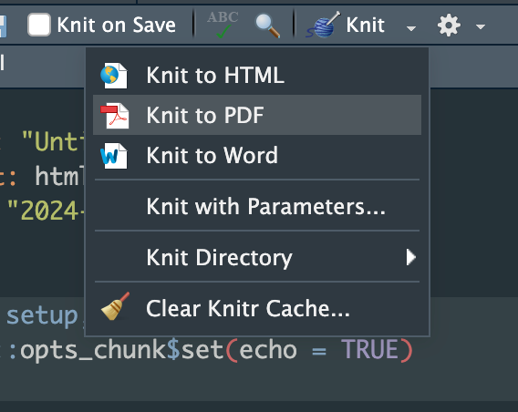
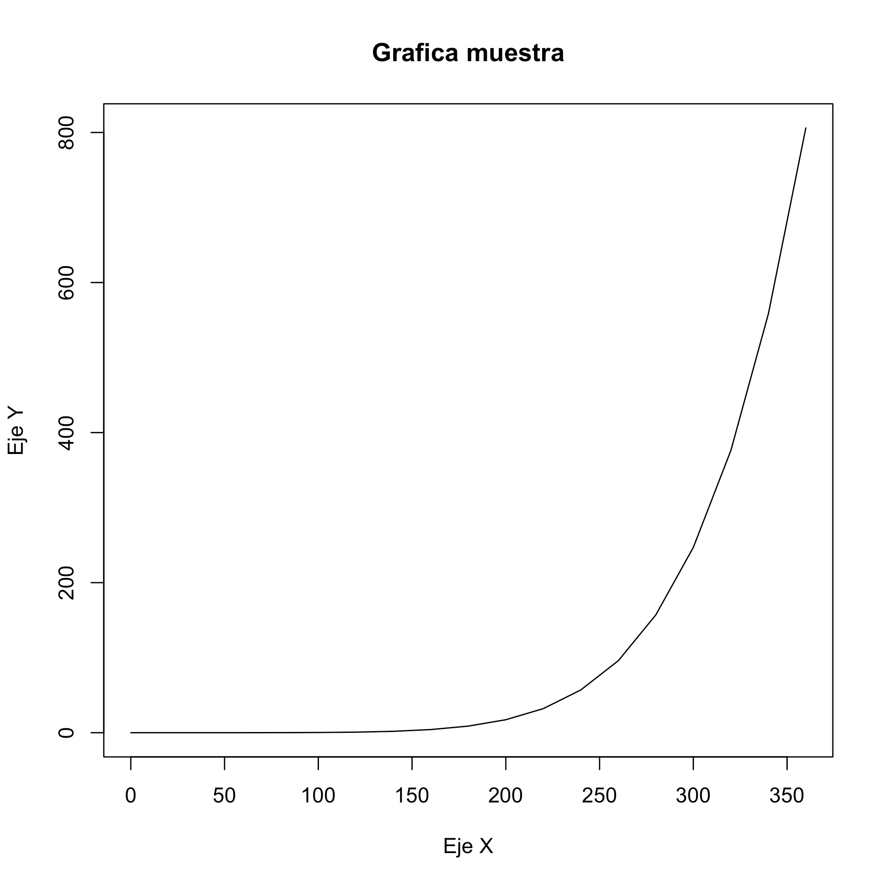
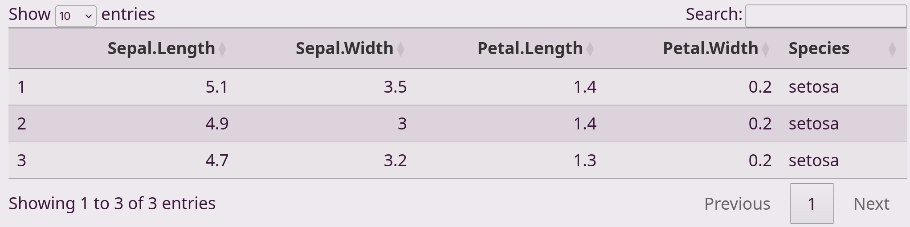
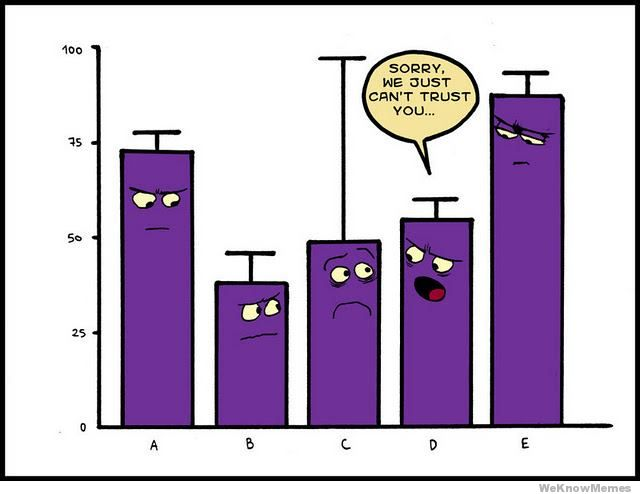

# ¿Que es y para que sirve Rmarkdown?

Es una herramienta que permite escribir documentos dinamicos con código de R, de manera fácil y legible.

# ¿Por que realizar un Rmarkdown?

Nos ayuda a entregar un reporte interactivo ya sea en archivo html o pdf.

# ¿Como creamos un archivo Rmarkdown?

Vayamos a la parte superior al menú Archivos \> Nuevo documento.

### Lo primero que vamos a tener será un archivo vacio así:


Y para poder generar los documentos hay que knitearlo así:



Los archivos que se pueden generar son:

PDF (Tesis o curriculum vitae)

html (página web o presentaciones)

Word

## Organización de la información:

**División de titulos:**

```         
# Titulo principal
```

\## Subtitulo 1

\### Subtitulo 2

\#### Subtitulo 3

\##### Subtitulo 4

# Titulo principal

## Subtitulo 1

### Organización de la información:

**División de titulos:**

```         
# Titulo principal

## Subtitulo 1

### Subtitulo 2

#### Subtitulo 3

##### Subtitulo 4
```

# Titulo principal

## Subtitulo 1

### Subtitulo 2

#### Subtitulo 3Subtitulo 2

#### Subtitulo 3

## Organización de la información:

**Estilos de las letras:** para modificar el estilo hay que agregar un '\*' antes y despúes del texto.

```         
italica*
```

\*negritas\*\*

\*\*ambos\*\*\*

\~\~tachado\~\~

\<span style="color:blue"\>Texto azul\</span\>

*italica*.\
**negritas**.\
***ambos***.\
~~tachado~~.\
[Texto azul](#) (La pagina web no soporta span)

## Organización de la información:

**Listas:**

```         
  uno
  
  dos

 - 2a

  - 2b

 * tres

  - 3a

    + 3rd layer

  - 2b

* cuatro
```

-   

-   uno

-   

-   dos

    -   

    -   2a

    -   

    -   2b

    -   

-   

-   tres

    -   

    -   3a

        -   

        -   3rd layer

        -   

    -   

    -   2b

    -   

-   

-   cuatro

## Diferentes lenguajes de programación

### Existen varios lenguajes de programación que se pueden usar en un Rmarkdown


## Diferentes lenguajes de programación

### R

``` r
x = 'hello, world!'
x

# [1] "hello, world!"
```

### Bash

``` bash
x=$(echo 'hello, world!')

echo $x

# hello, world!
```

## Visualización de datos

Vamos a usar un set de data predeterminado de R, este se llama pressure. Y vamos a visualizar los datos con la función head()

``` r
head(pressure)

#   temperature pressure

# 1           0   0.0002

# 2          20   0.0012

# 3          40   0.0060

# 4          60   0.0300

# 5          80   0.0900

# 6         100   0.2700
```

Para ver las estadisticas de estos datos usamos la función summary()

``` r
summary(pressure)

#   temperature     pressure       

#  Min.   :  0   Min.   :  0.0002  

#  1st Qu.: 90   1st Qu.:  0.1800  

#  Median :180   Median :  8.8000  

#  Mean   :180   Mean   :124.3367  

#  3rd Qu.:270   3rd Qu.:126.5000  

#  Max.   :360   Max.   :806.0000
```

Ahora haremos un plot con los datos.

``` r
plot(pressure, type="l", main="Grafica muestra", xlab="Eje X", ylab="Eje Y")
```



## Ejercicio:

1.  Crea un Rmarkdown

2.  Carga el siguiente set de datos

``` r
datos <- read.csv("https://raw.githubusercontent.com/rpizarrog/Curso-Titulacion-Data-Science-/master/2020/datos/starwars.csv", encoding = "UTF-8")
```

-   Visualiza los datos usando la funcion (head)

-   Crea Titulos y subtitulos en el archivo usando la tematica del dataset.

## Generacion de tablas

La forma más sencilla es de la siguiente manera:

``` r
Cabecera A | Cabecera B
-- | --
Campo A1 | Campo B1
Campo A2 | Campo B
```

| Cabecera A | Cabecera B |
|------------|------------|
| Campo A1   | Campo B1   |
| Campo A2   | Campo B2   |

Si queremos modificar la alineación de las columnas. Se pueden poner dos puntos para especificar el orden.

``` r
| Objetos a la izquierda    | Obetos centrados   | Objetos a la derecha   |
| :------- | :------: | -------: |
| 1   | a  | i   |
| 2   | b  | ii  |
```

| Objetos a la izquierda | Objetos centrados | Objetos a la derecha |
|------------------------|-------------------|----------------------|
| 1                      | a                 | i                    |
| 2                      | b                 | ii                   |

Tambien podemos generar tablas en formato de html

| Num | Header | Header2 | Header3 |
|-----|--------|---------|---------|
| 1   | first  | 1st     | One     |
| 2   | second | 2nd     | Two     |
| 3   | third  | 3rd     | Three   |

``` r
iris %>%
  head(3) %>%
  DT::datatable()
```



## Ejercicio:

Has una tabla con la siguiente informacion:

``` r
head(datos[,1:5])
#   X           name height mass  hair_color
# 1 1 Luke Skywalker    172   77       blond
# 2 2          C-3PO    167   75        <NA>
# 3 3          R2-D2     96   32        <NA>
# 4 4    Darth Vader    202  136        none
# 5 5    Leia Organa    150   49       brown
# 6 6      Owen Lars    178  120 brown, grey
```

## Respuesta del ejericicio

``` r
X | name | height | mass | hair_color
-- | -- | -- | -- | -- 
1    | Luke Skywalker | 172 | 77 | blond
2    | C-3PO | 167 | 75 | NA
3 |    R2-D2 |    96 |    32 |    NA
4    | Darth Vader |    202 |    136 |    none
5 |    Leia Organa |    150 |    49 |    brown
6 |    Owen Lars |    178 |    120 |    brown, grey
```

| X   | name           | height | mass | hair_color  |
|-----|----------------|--------|------|-------------|
| 1   | Luke Skywalker | 172    | 77   | blond       |
| 2   | C-3PO          | 167    | 75   | NA          |
| 3   | R2-D2          | 96     | 32   | NA          |
| 4   | Darth Vader    | 202    | 136  | none        |
| 5   | Leia Organa    | 150    | 49   | brown       |
| 6   | Owen Lars      | 178    | 120  | brown, grey |

## Agregar imagenes en un reporte

### Desde internet

``` markdown

```



# Agregar imagenes en un reporte

### Desde un archivo de nuestra computadora

```         

```


# Realizar calculos en un texto

Podemos realizar calculos matematicos en el texto usando comillas invertidas () en ambos extremos.

``` markdown
La suma de 4 mas 5 es 'r 4+5'

La division de 4 entre 5 es 'r 4/5'

La multiplicacion de 4 por 5 es 'r 4*5'

Si 4^5 cuanto es? 'r 4^5'

Redondear valores, 9.44 se redondea a 'r round(9.44,1)'
```

La suma de 4 mas 5 es 9.

La division de 4 entre 5 es 0.8.

La multiplicacion de 4 por 5 es 20.

Si 4\^5 cuanto es? 1024.

Redondear valores, 9.44 se redondea a 9.4.

## Agregar una ecuacion matematica

```         
En la misma linea: $A = \pi*r^{2}$ 

Aparte: 

$$y = \mu + \sum_{i=1}^p \beta_i x_i + \epsilon$$

Agregar subindices para formulas CO~2~, alternativamente con `html` CO<sub>2</sub>

Agregar super indice E=MC^2^ o $E=MC^2$, alternativamente con `html` E=MC<sup>2</sup>
```

-   En la misma linea: A=π∗r2

-   Aparte:

    $$
    y = \mu + \sum_{i=1}^p {B_i x_i + \epsilon}
    $$

-   Agregar subindices para formulas CO\~2\~, alternativamente con `html` CO~2~

-   Agregar super indice E=MC\^2\^ o E=MC2, alternativamente con `html` E=MC^2^

## Agregar un indice en el reporte

-   Informacion incial

``` markdown
title: "Introduccion a Rmarkdown"
author: "Alejandra Schafer"
date: "2024-02-23"
output: html_document
```

-   Informacion modificada para agregar el indice.

``` markdown
title: "Introduccion a Rmarkdown"
author: "Alejandra Schafer"
date: "2024-02-23"
output: 
  - html_document:
  - toc: yes
  - toc_float: yes
  - toc_depth: 6
  - theme: cerulean
```

``` markdown
title: "Introduccion a Rmarkdown"
author: "Alejandra Schafer"
date: "2024-02-23"
output: 
  - html_document:
  - toc: yes
  - toc_float: yes
  - toc_depth: 6
  - theme: cerulean
```

-   **toc** es para indicar que vas a agregar un indice en el reporte.

-   **toc_float** es para indicar si el indice va a ser flotante o no, si indicas `yes` el indice se localizara a la izquiera de la pantalla y la informacion se desplegara cuando se coloques sobre ella.

-   **toc_depth** es para indicar el numero de subtitulos que puedes tener en el archivo.

-   **theme** es la decoracion del archivo.

Para mas temas puedes entrar al siguiente link: <https://www.datadreaming.org/post/r-markdown-theme-gallery/>

## Configuracion de los chunks

En los chunks algunas cosas que se pueden especificar son: {r setup1, include = FALSE, echo= FALSE, eval=FALSE}:

-   **include** = FALSE: no muestra el código.

-   **echo** = FALSE: no muestra el resultado en el documento final.

-   **warning** = FALSE: no muestra los warnings.

-   **error** = FALSE: no muestra los mensajes de error.

-   **message** = FALSE: no muestra los mensajes.

-   **collapse** = TRUE: de ser posible colapsa la fuente y outputs de los bloques de código.

-   **eval** = FALSE: no evalúa los códigos, sirve para mostrar bloques de código sin que emita resultados.

-   **fig.dim** = c(n,m): vector numérico para el tamaño de los plots.

-   **fig.cap** = "message": para colocar un caption a los plots.

Pueden encontrar mas opciones para los chunks en el siguiente link: <https://yihui.org/knitr/options/#chunk-options>
