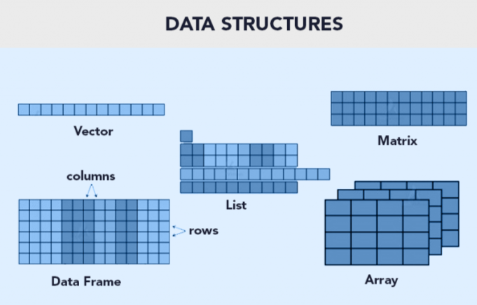

La manipulación de datos con funciones de R base es un tema esencial en análisis de datos. En este contexto, R ofrece una variedad de herramientas para transformar, filtrar y resumir datos. Desde la importación hasta la limpieza, estas funciones te permiten trabajar con data frames y vectores de manera eficiente.

La manipulación de datos implica tareas como filtrar filas, seleccionar columnas, crear nuevas variables y calcular estadísticas descriptivas. Además, puedes combinar múltiples data frames y aplicar operaciones a nivel de fila o columna.

## Paquetes necesarios

``` r
install.packages("dplyr")    # Manipulación de datos
install.packages("tidyr")    # Manipulación de datos
install.packages("tidyverse")# Manipulación de datos
install.packages("reshape2") # Transformación de datos
install.packages("ggplot2")  # Visualización grafica
install.packages("cowplot")  # Generar varios graficos en una misma figura
```



## Funciones básicas en R

| Función  | Empleo                                        | Documentación | Empleos                          |
|------------------|-------------------|------------------|------------------|
| sum()    | Adición / suma                                | ?sum          | sum(2+7)                         |
| prod()   | Sustracción/resta                             | ?prod         | prod(9-2)                        |
| max()    | Valor máximo                                  | ?max          | max(c(1,2,3,4,5))                |
| min()    | Valor mínimo                                  | ?min          | min(1:5)                         |
| range()  | Rango                                         | ?range        | range(c(2,8,7,6,1))              |
| mean()   | Promedio                                      | ?mean         | mean(c(2,8,7,6,1))               |
| median() | Mediana                                       | ?median       | median(c(2,8,7,6,1))             |
| var()    | Varianza                                      | ?var          | var(1:10); var(1:5, 1:5)         |
| con()    | Covarianza                                    | ?cov          | cov(1:10, 2:11)                  |
| cor()    | Matriz de correlación                         | ?cor          | cor(1:10,2:11)                   |
| unique() | Valor unico                                   | ?unique       | unique(df\$expression)           |
| sort()   | Ordenar                                       | ?sort         | sort(df\$expression)             |
| order()  | Ordenar                                       | ?order        | df[order(df\$expression),]       |
| table()  | cuentas de cada valor en tablas               | ?table        | table(df)                        |
| subset() | Extraer información de una MATRIZ o DATAFRAME | ?subset       | subset(df, expression == 1.8)    |
| sample() | Extraer información de manera aleatoria       | ?sample       | sample(df\$expression, size = 3) |
| length() | Número de elementos de un VECTOR              | ?length       | length(df\$expression)           |
| dim()    | Dimensiones de una MATRIZ o DATAFRAME         | ?dim          | dim(df)                          |
| is.na()  | Es un valor NA?                               | ?is.na        | is.na(df)                        |
| t()      | Cambiar filas por columnas (transposición)    | ?t            | t(df)                            |

Existen otras funciones matematicas como `log, exp,log10, log2, sin, cos, tan, asin, acos, atan, abs, sqrt`, etc.

### Otras funciones importantes son **rbind()** y **cbind()**

Puedes encontrar su documentación empleando ?rbind y ?cbind

#### cbind()

Podemos unir las columnas dos vectores.

``` r
a <- c(1, 3, 3, 4, 5)
b <- c(7, 7, 8, 3, 2)
new_matrix <- cbind(a, b)
new_matrix
#      a b
# [1,] 1 7
# [2,] 3 7
# [3,] 3 8
# [4,] 4 3
# [5,] 5 2
```

Crear un dataframe

``` r
df <- data.frame(genes = paste0("Gen", seq_len(8)), 
                 expression = c(3.8, 5.5, 6.3, 1.8, 9, rep(3,3)), 
                 treatment =c(rep("Control", 4), rep("Condicion1",4)))
```

Tambiend podemos incorporarle una nueva columna a un *dataframe*

``` r
date_sample <- rep(c(11, 12, 13, 14),2)
df <- cbind(df, date_sample)
# Renombrar columna 4
colnames(df)[4] <- "Date"
head(df)
#   genes expression  treatment Date
# 1  Gen1        3.8    Control   11
# 2  Gen2        5.5    Control   12
# 3  Gen3        6.3    Control   13
# 4  Gen4        1.8    Control   14
# 5  Gen5        9.0 Condicion1   11
# 6  Gen6        3.0 Condicion1   12
```

#### rbinf()

Vamos a unir dos *dataframe* pero ambos deben tener el mismo numero y nombre en su columnas.

> NOTA: Los rownames deben ser Únicos, por lo que no debemos comenzar desde el Gen1.

``` r
df_v2 <- data.frame(genes = paste0("Gen", 9:16), 
                    expression = c(6.1, 6.2, 5, 2, 7, rep(8,3)), 
                    treatment = c(rep("Control", 4), rep("Condicion1",4)),
                    Date = rep(c(11, 12, 13, 14),2) )
df_v2$treatment <- as.factor(df_v2$treatment) # conversión a factor
#unir
df_new <- rbind(df, df_v2)
head(df_new)
#   genes expression  treatment Date
# 1  Gen1        3.8    Control   11
# 2  Gen2        5.5    Control   12
# 3  Gen3        6.3    Control   13
# 4  Gen4        1.8    Control   14
# 5  Gen5        9.0 Condicion1   11
# 6  Gen6        3.0 Condicion1   12
```

### Información de la estructura de un dataframe

Para ver su estructura e información:

``` r
dim(df)    # dimensiones [fila, columna]
length(df) # largo, número de columnas
ncol(df)   # número de columnas
nrow(df)   # número de filas
names(df)  # nombre de las columnas
str(df)    # Estructura
```

Podemos adornar la salida colocando estas notas.

``` r
cat("Dimensiones:", dim(df), "\n")
# Dimensiones: 8 4
cat("Numero de columnas:", ncol(df), "\n")
# Numero de columnas: 4
cat("Numero de filas:", nrow(df), "\n")
# Numero de filas: 8
cat("Nombre de las columnas:", names(df), "\n")
# Nombre de las columnas: genes expression treatment Date
```

> NOTA: El "\n" indica saltos de linea en el texto.

### Función **which()**

Podemos usar esta función para extraer la informacion y/o las posiciones que cumpla con un argumento logico.

Documentación ?which

``` r
x <- c(1, 5, 4, 8, 4) 
which(x == 4 | x == 1)  # condicional que sea igual a 4 o a 1
# [1] 1 3 5
```

**¿Cuántos números son iguales a 4 y a 1?**

``` r
length(which(x == 4 | x == 1))   
# [1] 3
```

#### En una matriz

##### **Ejemplo 1: Obtener las valores que al divirse entre 3 sean iguales a cero**

``` r
m <- matrix(1:12, 3, 4) # Generar una matriz de 3 x 4
# Opción A - con R base
m[m %% 3 == 0]
# [1]  3  6  9 12
# Opción B - con la función which
div.3 <- m %% 3 == 0 
which(div.3) # OR which(m %% 3 == 0)
# [1]  3  6  9 12
```

##### Ejemplo 2: Obtener las posiciones de los numeros que al divirse entre 3 sean iguales a cero

``` r
# Para obtener la información de las posiciones podemos usar:
which(div.3, arr.ind = TRUE)
#      row col
# [1,]   3   1
# [2,]   3   2
# [3,]   3   3
# [4,]   3   4
# Ejemplo 2
rownames(m) <- paste("Case", 1:3, sep = "_") # renombrar las filas
which(m %% 5 == 0, arr.ind = TRUE) # Extraer las posiciones que cumplan con la condición logica
#        row col
# Case_2   2   2
# Case_1   1   4
```

### Index

Por medio de un **index** podemos:

-   

    1)  Obtener la información de un dato en específico.

-   

    2)  Modificar un dato en específico.

-   

    3)  Eliminarlo un dato en específico.

Podemos hacer la pregunta de dos maneras, 1) ¿Cuál es el nivel de expresión del Gen2? O 2) ¿Que gen contiene una expresión de 5.5?


#### Función **which()** en un dataframe

**¿Que gen contiene una expresión de 1.8?**

``` r
# Opción A
which(df == 1.8, arr.ind = TRUE)
#      row col
# [1,]   4   2
```

``` r
# Opción B
df[which(df$expression == 1.8), ]
#   genes expression treatment Date
# 4  Gen4        1.8   Control   14
```

# Repaso

## Paso 1. Crear un RBioProject


## Paso 2. Descargar los datos y verificar su ubicaciónen la carpeta **data/**

1)  Descarga los tres datasets de Marvel dando click en este [link](https://github.com/cosmoduende/r-marvel-vs-dc/tree/main/dataset_shdb), debes tener tres archivos en la misma carpeta `charactersStats.csv`, `heroesInformation.csv` y `superHeroPowers.csv`. Asegúrate de guardarlo en el directorio donde hiciste tu Rproject. En mi caso, guarde los datos en la carpeta `data/`.

2)  Verifica que se encuentren los tres archivos en la carpeta `data/`.

``` r
dir("data")
#  [1] "charactersStats.csv"   "dirty_iris.csv"        "fullMarvelDc.RData"   
#  [4] "heroesInformation.csv" "Info_data.RData"       "marvelDc.RData"       
#  [7] "marvelDcInfo.RData"    "MMHOME.csv"            "planets.csv"          
# [10] "superheroes.RData"     "superHeroPowers.csv"
```

## Paso 3. Importar los datos en R

3)  Importa los archivos en R de la siguiente manera:

``` r
infoCharacters <- read.csv("data/heroesInformation.csv", na.strings = c("-", "-99")) 
# La opción na.string nos permite sustituir valores - y -99 por NA
infoPowers <- read.csv("data/superHeroPowers.csv")
infoStats <- read.csv("data/charactersStats.csv", na.strings = "")
```

Visualiza su información con `head()` o `View()`.

> **NOTA:** Primero debes crear la carpeta data/ antes de descargar los archivos.

### Buenas prácticas

Nuestro script debe verse asi:

``` r
######
# Script de clase "Intro a R"
# Evelia Coss
# 8 de marzo 2024
#######
indir = "C:/Users/ecoss/OneDrive - CINVESTAV/Documentos/Posdoc_LIIGH/VieRnesBioinfo/ViernesBioinfo_2024/Presentaciones/data/"
outdir = "C:/Users/ecoss/OneDrive - CINVESTAV/Documentos/Posdoc_LIIGH/VieRnesBioinfo/ViernesBioinfo_2024/Presentaciones/"
# Importar datos
infoCharacters <- read.csv(paste0(indir,"heroesInformation.csv"), na.strings = c("-", "-99")) 
# La opción na.string nos permite sustituir valores - y -99 por NA
infoPowers <- read.csv(paste0(indir,"superHeroPowers.csv"))
infoStats <- read.csv(paste0(indir,"charactersStats.csv"), na.strings = "")
```

## Paso 4. Renombrar la columna Name en todos los dataframe

Vamos a unificar el nombre las columnas que tienen los nombre en todas las columnas colocando el nombre Name. El dataframe infoStats ya contiene ese nombre en la columna 1.

``` r
colnames(infoCharacters)[colnames(infoCharacters) == "name"] <- "Name"
colnames(infoPowers)[colnames(infoPowers) == "hero_names"] <- "Name"
```

## Paso 5. Seleccionar SOLO los datos de Marvel Comics y DC Comics

Podemos usar la función `unique()` para obtener los **valores únicos** en un vector o de una columna en un dataframe.

``` r
# Empresas comprendidas en esta base de datos
unique(infoCharacters$Publisher)
#  [1] "Marvel Comics"     "Dark Horse Comics" "DC Comics"        
#  [4] "NBC - Heroes"      "Wildstorm"         "Image Comics"     
#  [7] ""                  "Icon Comics"       "SyFy"             
# [10] "Hanna-Barbera"     "George Lucas"      "Team Epic TV"     
# [13] "South Park"        "HarperCollins"     "ABC Studios"      
# [16] "Universal Studios" "Star Trek"         "IDW Publishing"   
# [19] "Shueisha"          "Sony Pictures"     "J. K. Rowling"    
# [22] "Titan Books"       "Rebellion"         "Microsoft"        
# [25] "J. R. R. Tolkien"
```

### Verificamos las dimensiones

Esperariamos que cada fila sea un solo personaje, pero este dataframe contiene nombres repetidos.

``` r
dim(marvelDcInfo)
# [1] 603  11
```

Esperariamos que las **filas representaran el numero de personales**, teniendo un total de 603 personajes y las **columnas representaran las variables**, teniendo un total de 11 variables.

Sin embargo, podemos extraer los nombres de los personajes que solo se repitan una vez y veremos que nuestro dataset no esta limpio. Ya que solo tiene un total de 585 personajes.

``` r
length(unique(marvelDcInfo$Name))
# [1] 585
```

### Observar valores duplicados

Observar cuales se duplican mediante la función [`duplicated()`](https://www.rdocumentation.org/packages/base/versions/3.6.2/topics/duplicated) de R base.

``` r
head(marvelDcInfo[duplicated(marvelDcInfo$Name), ], 3)
#     X    Name Gender Eye.color          Race Hair.color Height Publisher
# 49 48   Atlas   Male      blue God / Eternal      Brown    198 DC Comics
# 51 50    Atom   Male      <NA>          <NA>       <NA>    -99 DC Comics
# 64 63 Batgirl Female     green         Human        Red    170 DC Comics
#    Skin.color Alignment Weight
# 49       <NA>       bad    126
# 51       <NA>      good    -99
# 64       <NA>      good     57
```

Para saber cuantos personajes duplicados podemos usar `length()`

``` r
length(marvelDcInfo[duplicated(marvelDcInfo$Name), ])
# [1] 11
```

Existen 11 personajes que se encuentran duplicados en esta base de datos.

### Revisemos un ejemplo de datos duplicados

Vamos a obtener la información de **Batman** y vemos que tiene dos filas pertenecientes al mismo personaje.

``` r
# Opción A
marvelDcInfo[marvelDcInfo$Name == "Batman", ]
#     X   Name Gender Eye.color  Race Hair.color Height Publisher Skin.color
# 69 68 Batman   Male      blue Human      black    188 DC Comics       <NA>
# 70 69 Batman   Male      blue Human      Black    178 DC Comics       <NA>
#    Alignment Weight
# 69      good     95
# 70      good     77
```

Tambien podemos usar la función `subset()` para extraer información de algun personaje.

``` r
# Opción B
subset(marvelDcInfo, Name == "Batman")
#     X   Name Gender Eye.color  Race Hair.color Height Publisher Skin.color
# 69 68 Batman   Male      blue Human      black    188 DC Comics       <NA>
# 70 69 Batman   Male      blue Human      Black    178 DC Comics       <NA>
#    Alignment Weight
# 69      good     95
# 70      good     77
```

## Empecemos con la limpieza de los datos

## Paso 6. Eliminar duplicados

El signo de exclamación `!` nos permite indicar lo contrario, es decir, devolverme todos los que no esten duplicados seria asi `!duplicated()`.

``` r
marvelDcInfo <- marvelDcInfo[!duplicated(marvelDcInfo$Name), ]
```

## Paso 7. Seleccionar columnas

``` r
marvelDcInfo <- marvelDcInfo[, c("Name", "Gender", "Race", "Publisher")]
head(marvelDcInfo, 3)
#          Name Gender              Race     Publisher
# 1      A-Bomb   Male             Human Marvel Comics
# 3    Abin Sur   Male           Ungaran     DC Comics
# 4 Abomination   Male Human / Radiation Marvel Comics
```

## Paso 8. Cambiar formatos en algunas columnas

Debemos convertir las columnas Name, Gender, Race y Publisher de character a factor.

``` r
str(marvelDcInfo)
# 'data.frame':    585 obs. of  4 variables:
#  $ Name     : chr  "A-Bomb" "Abin Sur" "Abomination" "Abraxas" ...
#  $ Gender   : chr  "Male" "Male" "Male" "Male" ...
#  $ Race     : chr  "Human" "Ungaran" "Human / Radiation" "Cosmic Entity" ...
#  $ Publisher: chr  "Marvel Comics" "DC Comics" "Marvel Comics" "Marvel Comics" ...
```

Para cambiar a factor usamos la función `as.factor()`.

``` r
marvelDcInfo$Name <- as.factor(marvelDcInfo$Name)
marvelDcInfo$Gender <- as.factor(marvelDcInfo$Gender)
marvelDcInfo$Race <- as.factor(marvelDcInfo$Race)
marvelDcInfo$Publisher <- as.factor(marvelDcInfo$Publisher)
```

## Ejercicios

1)  ¿Cuántos personajes hay por cada empresa?

2)  ¿Cuántos personajes son mujeres y hombres hay por cada empresa?

3)  ¿Cuántas razas hay en el dataframe?

4)  ¿Cuáles son las razas predominantes de cada empresa?

## 1) ¿Cuántos personajes hay por cada empresa?

### Opcion A

``` r
summary(marvelDcInfo$Publisher)
#     DC Comics Marvel Comics 
#           206           379
```

### Opcion B

``` r
table(marvelDcInfo$Publisher)
# 
#     DC Comics Marvel Comics 
#           206           379
```

## 2) ¿Cuántos personajes son mujeres y hombres hay por cada empresa?

### DC Comics

``` r
cat("DC Comics, hombres:", nrow(subset(marvelDcInfo, Publisher == "DC Comics" & Gender == "Male")), "\n")
# DC Comics, hombres: 147
cat("DC Comics, mujeres:", nrow(subset(marvelDcInfo, Publisher == "DC Comics" & Gender == "Female")), "\n")
# DC Comics, mujeres: 58
```

### Marvel

``` r
cat("Marvel, hombres:", nrow(subset(marvelDcInfo, Publisher == "Marvel Comics" & Gender == "Male")), "\n")
# Marvel, hombres: 245
cat("Marvel, mujeres:", nrow(subset(marvelDcInfo, Publisher == "Marvel Comics" & Gender == "Female")), "\n")
# Marvel, mujeres: 110
```

## 3) ¿Cuántas razas hay en el dataframe?

### Opción A

Eliminamos los NA que tengamos con `!is.na()`, posteriormente, obtenemos los nombres unicos y medimos.

``` r
length(unique(marvelDcInfo$Race[!is.na(marvelDcInfo$Race)]))
# [1] 48
```

### Opción B

Como esta columna se encuentra en factores, podemos ver el numero de niveles con a funcion `nlevels()`.

``` r
nlevels(marvelDcInfo$Race)
# [1] 48
```

## 4) ¿Cuáles son las razas predominantes de cada empresa?

Podemos usar la función [`sort()`](https://www.rdocumentation.org/packages/base/versions/3.6.2/topics/sort) para ordenar los datos de mayor a menor, usando el argumento `decreasing = TRUE`.

La raza ***Human o humana*** es la mas predominante en ambas empresas, seguida de la mutante en el caso de Marvel Comics.

``` r
head(sort(table(marvelDcInfo$Race), decreasing = TRUE), 10)
# 
#             Human            Mutant Human / Radiation     God / Eternal 
#               167                58                11                10 
#          Symbiote             Alien        Kryptonian           Android 
#                 8                 7                 7                 6 
#            Cyborg         Asgardian 
#                 6                 5
```

# Guardar variables para la siguiente clase

Guardar una sola variable

``` r
save(marvelDcInfo, file = "Presentaciones/data/marvelDcInfo.RData")
```

Guardar varias variables

``` r
save(infoStats, infoPowers, marvelDcInfo, file = "Presentaciones/data/Info_data.RData")
```
