RStudio es un entorno de desarrollo integrado (IDE) para R. Un IDE es una aplicación que ayuda a los programadores a desarrollar código de una manera eficiente. Nos proporciona una interfaz para poder editar código fuente, herramientas de ambiente, visualización, terminal y consola.

RStudio Desktop es una aplicación que se utiliza ampliamente para desarrollar programas en R, pero también podemos accesar al IDE de RStudio a través con RStudio Server, a través de un navegador web.


## ¿Cómo descargamos RStudio?

Podemos descargar RStudio desde [esta página](https://posit.co/download/rstudio-desktop/). Ya realizamos el paso 1: Install R.



En el paso 2: Install R studio, nos debería detectar el sistema operativo, descarguemos la versión recomendada en el botón **azul** y sigamos las instrucciones de instalación.

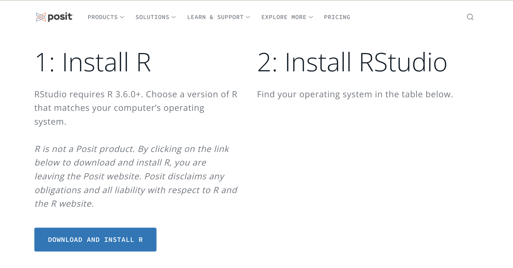

## Partes de Rstudio

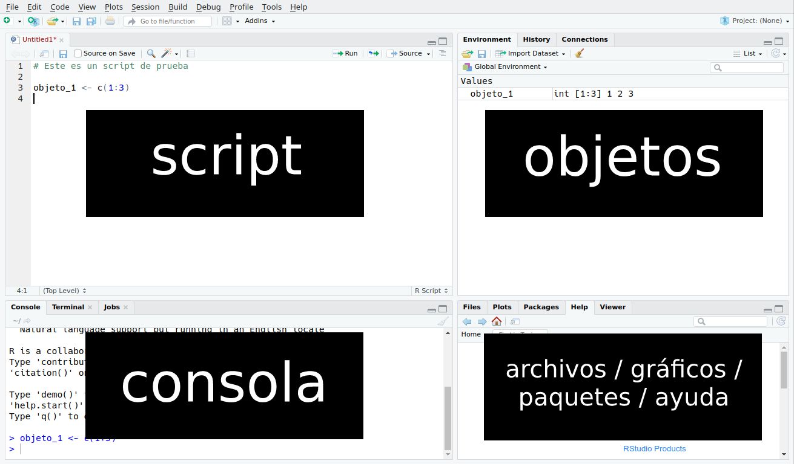

## Cambiando el Aspecto de Rstudio

Podemos cambiar la forma en que se ve la aplicación desde **Editar** > **Preferencias** > **Apariencia**, escogemos el tema que nos guste y damos click en **Aplicar** y luego **OK**


# Comenzando con R y RStudio: 1. R Project

Al comenzar a trabajar con R y RStudio, ya sea para crear un programa para un proyecto, crear una aplicación, presentación, blog, paquete, etc, es recomendado crear un **R project**.

Al crear un R project, se creará un folder en donde estarán todos los documentos, fotos, scripts, etc. que usaremos en ese projecto. Es una forma organizada y práctica de trabajar con R.


## ¿Cómo iniciamos un R project?

Vayamos en la parte superior al menú **Archivos** > **Nuevo Proyecto**.

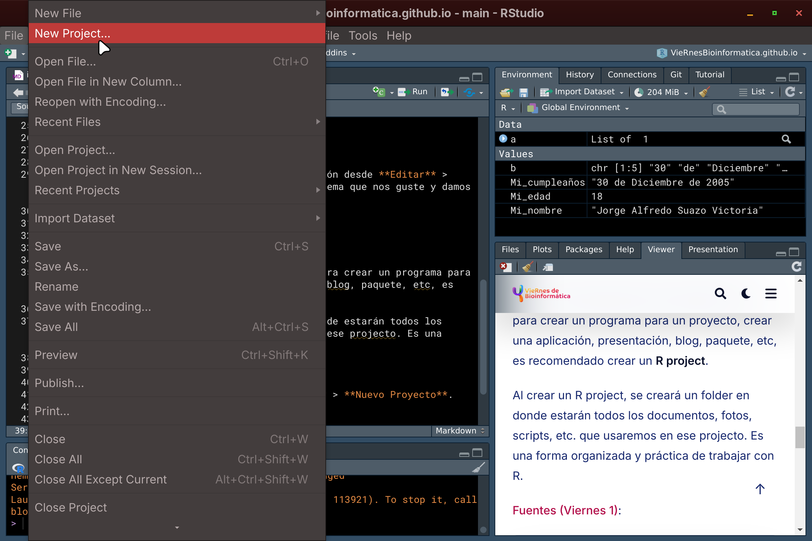

Seleccionamos la opción de **Nuevo Directorio**


Seleccionamos el tipo de projecto que vamos a iniciar, en nuestro caso **Nuevo Proyecto.**

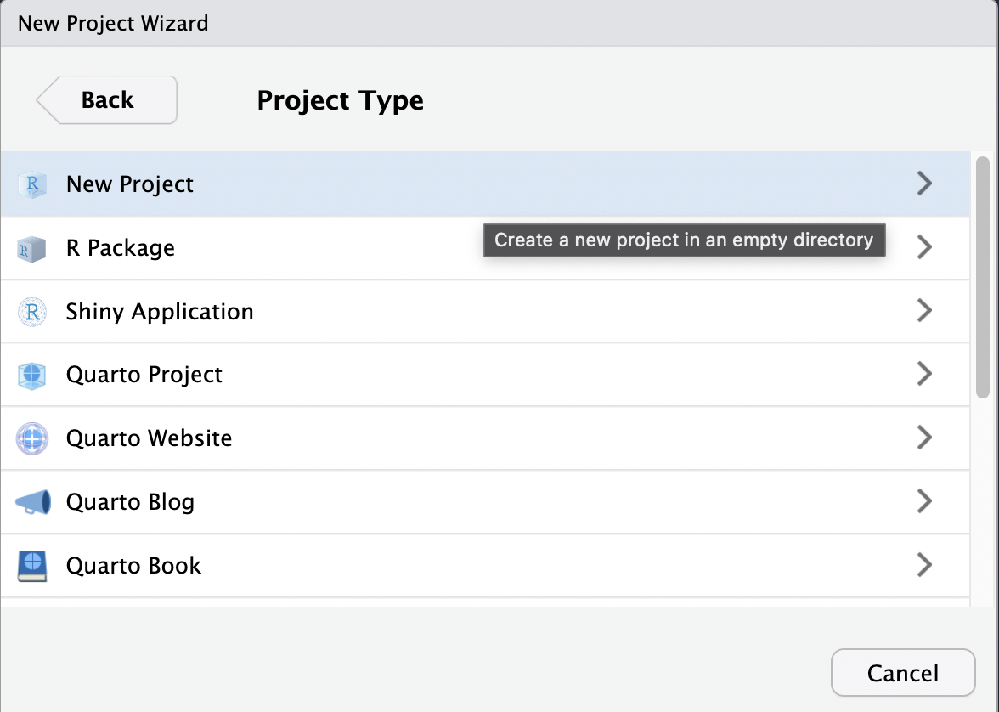

Nombramos el folder que creamos y seleccionamos en donde queremos que se almacene.

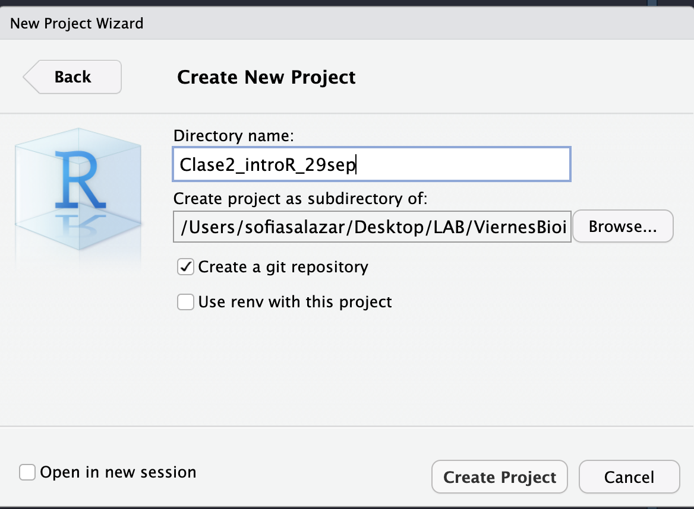


¡Felicidades, acabas de crear un R project! Si vamos al folder en donde creamos nuestro proyecto, podemos observar que se creó un archivo con terminación **Rproj**, este es un archivo que contiene la configuración específica para nuestro proyecto.

Este archivo también establece como **directorio de trabajo** el folder en donde iniciamos el proyecto (puedes comprobarlo desde la consola de RStudio, escribiendo el comando getwd()). Esto es muy conveniente puesto que así podemos asegurarnos de que vamos a acceder a los archivos que estén exclusivamente en nuestro entorno de trabajo.

```R
getwd()
```


[1] "C:/Users/ecoss/OneDrive -
CINVESTAV/Documentos/Posdoc_LIIGH
/VieRnesBioinfo/ViernesBioinfo_2024
/Presentaciones"



Cambiar directorio de trabajo

```R
setwd("/Users/sofiasalazar/nuevodirectorio") # Mac y Linux, iOS, ejemplo de Sofi
setwd("C:/Users/ecoss/OneDrive - CINVESTAV/Documentos/Posdoc_LIIGH/Clases_Cursos_Medicina_Guadalajara2023") # Windows
```

## Comenzando con nuestro proyecto: Crear un Rscript

Para comenzar a trabajar en un proyecto, necesitamos crear un archivo para escribir nuestro programa. Entra en **Archivo** > **Nuevo Archivo**.

Podemos ver que tenemos distintas opciones de archivos que podemos crear, en este caso vamos a crear nuestro primer Rscript.

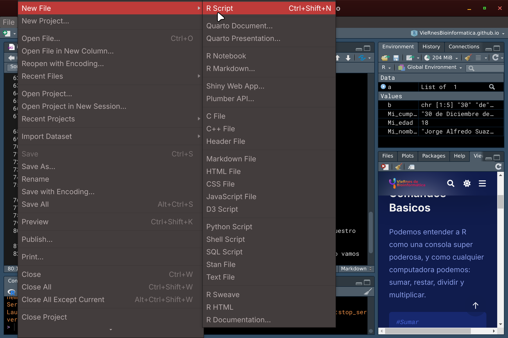


## Crear Un Script

**¿Qué es un Rscript?** Es simplemente un archivo de texto con las instrucciones de nuestro algoritmo escritas en el lenguaje de R. También contiene nuestros comentarios escritos con #.

Intenta escribir tu primer Rscript en el editor, copiando el siguiente algoritmo para realizar una suma:

```R
a <- 2
b <- 3
suma = a + b
suma
```

Selecciona todo el código, después ve a la parte superior de la ventana del **editor** y da click en el botón **Run**. Enseguida de esto, en la **consola** se ejecutará tu código y podrás ver el siguiente resultado:



Meme super importante


## R session
Al momento de comenzar a ejecutar líneas de código, guardar valores en variables y cargar librerías, estaremos guardando esto en nuestra "sesión de R". Esto es un "ambiente" que puedes guardar al finalizar de trabajar y lo que guardaste lo puedes cargar a Rstudio la próxima vez que vayas a continuar trabajando.

Para guardar tu sesión de R:
```R
save.image(file = "/una/direccion/enTu/PC/sesionR_miPrograma.RData")
```
Para cargar tu sesión de R:
```R
load(file = "/una/direccion/enTu/PC/sesionR_miPrograma.RData")
```
También puedes guardar y cargar solo alguna variable:

```R
save(variable, file = "/una/direccion/enTu/PC/variable.RData")
load("/una/direccion/enTu/PC/variable.RData") # ahora "variable" estara en tu ambiente
```

## Buenas practicas

Buenas prácticas de programación: Set up de tu trabajo
Es buena idea comenzar todos tus scripts con las mismas líneas de código que indiquen lo siguiente:


- Título de tu programa
- Autor (author): Su nombre
- Fecha (date): Fecha de creación
- Propósito general de tu programa (Description): ¿Para qué sirve el programa? Ej: El siguiente programa realiza la suma de dos numeros enteros a partir de la entrada del usuario y posteriormente la imprime en pantalla.
- Usage ¿Cómo se utiliza?
- Paquetes (packages)
- Directorio de trabajo (Working directory): En que carpeta se encuentra tu datos y programa.
- Directorio de input: aquí estan guardados los datos que vas a usar en el programa
- Directorio de output: aquí es donde vas a guardar tus resultados
- Argumentos (Arguments)
- Información de entrada (Data Inputs): Ej: Solo numeros enteros (sin decimales).
- Información de salida (Outpus): Graficas, figuras, tablas, etc.
- Líneas en donde cargues los datos que vas a usar


Meme super importante 2


### Buenas prácticas de programación: Set up de tu trabajo

```R
# Mi programa
# Tu nombre
# Fecha: dd-mm-aaaa
# Este script ejecuta xxx utilizando como input xxx y dando como output xxx
# Input dir
indir <- "/Users/sofiasalazar/miPrograma/input/"
# Output dir
outdir <- "/Users/sofiasalazar/miPrograma/output/"
# Librerias
library(ggplot2)
library(tidyverse)
# Cargar input
datos_file <- paste0(indir,"misDatos.csv")
datos_file
```

```R
datos <- read.csv(datos_file)
load(file = paste0(indir, "variable.RData"))
load(file = paste0(indir, "sesionR_miPrograma.RData"))
```

## ¿Qué es una librería?

En programación, una librería es una colección de código pre-escrito. Una librería contiene una "paquete" o "librería" de funciones que podemos utilizar si descargamos e importamos esa librería a nuestro programa.

Como mencioné anteriormente, al descargar R, también descargamos una serie de librerías, llamadas **base R packages**. Sin embargo, dependiendo del problema que queramos resolver con nuestro programa, necesitaremos librerías que nos permitan hacer otras cosas.

Existen distintas formas de instalar librerías.

### Instalar librerías: CRAN
1. Instalación desde el repositorio de CRAN: podemos descargar paqueterías de CRAN de dos formas:

La primera, desde consola con el siguiente comando:

```R
install.packages("ggplot2")
```
La segunda, desde el menú **Herramientas > Instalar paqueterías**. En la ventana, ingresamos el nombre de la librería y click en **Instalar**.

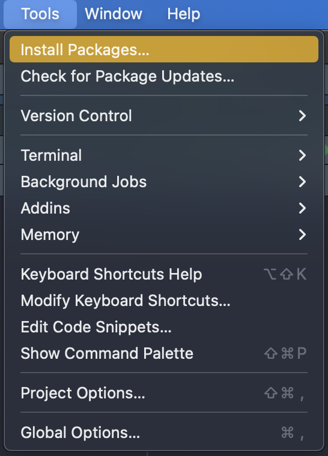

###Instalar librerías: Bioconductor

Alternativamente, podemos instalar paqueterías de Bioconductor, que es otro repositorio de paquetes diseñados para el análisis de datos genómicos, por ejemplo para hacer análisis estadísticos, anotación, acceso a bases de datos públicas, etc.

Hay muchas librerías que están tanto en CRAN como en Bioconductor, pero también hay librerías específicas para uno de ellos. Para poder instalar desde bioconductor, necesitamos primero instalar el "instalador de bioconductor":

```R
install.packages("BiocManager") # Esto es necesario solo 1 vez
```
Después, instalamos la librería que queremos y la cargamos:
```R
BiocManager::install("DESeq2")
library(DESeq2)
```
Puedes ver librerías y sus manuales en la [página de Bioconductor](https://www.bioconductor.org/) o cuando ingresamos en consola:
```R
browseVignettes("DESeq2")
```

### Instalar librerías: Source
Podemos instalar librerías si tienes los archivos en tu PC, esto es útil cuando no tienes acceso a internet.
```R
install.packages("~/Downloads/ggplot2_1.0.1.tar.gz", type="source", repos=NULL)
```
O desde GitHub:
```R
install.packages("remotes")# instalar el paquete remotes
remotes::install_github("mitchelloharawild/icons")
```
Cuando hay funciones que tienen el mismo nombre en varios paquetes, lo mejor es que le digas a R de que paquete viene esa función mediante los
```::.``` Ejemplo: ```dplyr::select()```

### ¿Cómo podemos verificar que paquetes tenemos?

En la ventana inferior derecha, existe una pestaña que se llama "Packages" que contendra la lista de paquetes instalados en tu computadora, su descripción corta y su versión.

Tambien en esta pestaña podemos instalar paquetes dandado click en INSTALL.

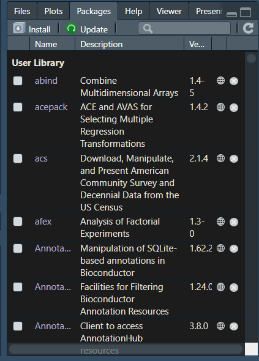

### Eliminación de paquetes
En algunas ocasiones vamos a tener que actualizar las versiones de los paquetes, pero primero dedes eliminar la versión anterior. Dando click en el botón que contiene una X que esta al final de la fila en cada programa.

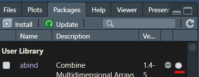

También puedes usar codigo para eliminar el paquete:

```R
remove.packages("package-to-remove")
```

### Cargar paquetes en el ambiente de R
Opción A: Emplear la función library para cargar en el ambiente el paquete.
```R
library(ggplot2)
```
Opción B: Dando click a la casilla que indica el paquete. Para dejar de usarlo da de nuevo click en esa casilla para que deje de estar marcada.

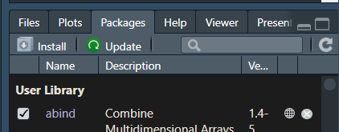

### Buenas prácticas al finalizar tu programa
- **Guarda tu output**
```R
write.csv(datos_procesados, file = paste0(outdir, "datos_procesados.csv"))
save(datos_procesados, file = paste0(outdir, "datos_procesados.RData"))
save.image(file = paste0(outdir, "sesionR_miPrograma.RData")
```
- **Especifica qué librerías utilizaste y qué versiones**

Cuando hacemos un programa, puede que en el futuro otras personas lo quieran utilizar, sin embargo, es probable que **las librerías que usaste en el momento que escribiste el programa se hayan actualizado.**

Es por eso que **al final de TODO programa que escribas, ejecutes y escribas el resultado de correr la siguiente línea.**
```R
sessionInfo()
```

Puedes intentar correr este comando tú, lo que verás impreso en consola son todas las librerías instaladas en tu sesión de R, así como **la versión**. Entonces así, si alguien quiere reproducir tus resultados en algún momento, deberá instalar las mismas versiones de las librerías que tú utilizaste.

## Importar datos en R
Existen distintos tipos de formatos de datos que podemos ingresar a R para su análisis. Los principales son:

### A) Datos separados por un valor
Por ejemplo por comas (.csv), tab (.tsv) o espacios. Aunque la siguiente función puede leer por cualquier separador.
```R
read.table("/path/dataset.csv", header = TRUE, delim = ",")
read.table("/path/dataset.tsv", header = TRUE, delim = "\t")
read.table("/path/dataset.", header = TRUE, delim = ",")
```
El parámetro header nos dice si considerar la primera fila como nombre de las variables.

También podemos leer un archivo .csv directamente:
```R
read.csv("/path/dataset.csv")
```

### Datos en formato CSV
Archivos separados por comas.

Este ejemplo fue obtenido del repositorio de Github de [Cosmoduende](https://github.com/cosmoduende/r-marvel-vs-dc/blob/main/dataset_shdb/charactersStats.csv).


### Datos en formato TSV
Archivo separado por tabuladores.

Este ejemplo proviene de la base de datos de Arabidopsis thaliana, la planta modelo en el estudio de la genómica. Este archivo indica el tipo o característica del gen anotado en [Araport11](https://www.arabidopsis.org/download_files/Genes/Araport11_genome_release/Araport11_gene_type).

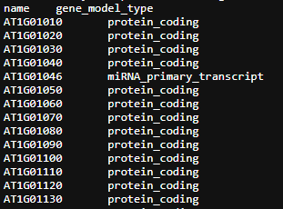

#### Se pueden cargar datos biológicos en formato TSV
-Formato de texto plano - [Araport11 Gene Type.txt](https://www.arabidopsis.org/download_files/Genes/Araport11_genome_release/Araport11_gene_type)
-[Formato GFF](https://genome.ucsc.edu/FAQ/FAQformat.html#format3): [Araport11_GFF3_genes_transposons.current.gff](https://drive.google.com/file/d/1EBl07-o6Ai2QvOzDwjbFmazipWK1Jgj2/view?usp=share_link)
-[Formato GTF](https://genome.ucsc.edu/FAQ/FAQformat.html#format4): [Araport11_GTF_genes_transposons.current.gtf](https://drive.google.com/file/d/1XdQqVeaeB6Uz2AGFWRrUmKJ_9z2goYZX/view?usp=share_link) -
-[Formato BED12](https://genome.ucsc.edu/FAQ/FAQformat.html) - [Araport11_pcoding_transcripts.bed](https://drive.google.com/file/d/1a3UzS6X_rQ8eyw0WllM8vR8DK4Aq3dR6/view?usp=share_link)

### Otros formatos
#### B) Archivos tipo RData
Usualmente cargan todo el ambiente o varias variables
```R
load("/path/ambiente.RData")
```
#### C) Archivos tipo RDS
Se usan para cargar variables, usualmente muy pesadas
```R
variable <- readRDS("/path/variable.RData")
```

## Crea un RProject

### Recapitulando las buenas prácticas:
```R
######
# Script de clase "Intro a R"
# Evelia Coss
# 9 de octubre 2023
#######
indir = "C:/Users/ecoss/IntroR_BasesDeDatos2023/data/"
outdir = "C:/Users/ecoss/IntroR_BasesDeDatos2023/results"
```

### Ejercicio: cargar un dataset
Descarga los tres datasets de Marvel dando click en este link, debes tener tres archivos en la misma carpeta charactersStats.csv, heroesInformation.csv y superHeroPowers.csv. Asegúrate de guardarlo en el directorio donde hiciste tu Rproject. En mi caso, guarde los datos en la carpeta data/.

Importa los archivos en R de la siguiente manera:
```R
infoCharacters <- read.csv("data/heroesInformation.csv", na.strings = c("-", "-99")) 
# La opcion na.string nos permite sustituir valores - y -99 por NA
infoPowers <- read.csv("data/superHeroPowers.csv")
infoStats <- read.csv("data/charactersStats.csv", na.strings = "")
```
Visualiza su información con head() o View().


NOTA: Primero debes crear la carpeta data/ antes de descargar los archivos.



#### Recuerda: Verifica que el archivo este en el lugar correcto
1. Verifica tu directorio de trabajo
```R
getwd()
```


[1] "C:/Users/ecoss/OneDrive -
CINVESTAV/Documentos/Posdoc_LIIGH/VieRnesBioinfo/ViernesBioinfo_2024/Presentaciones"


2. Verifica que se encuentren los tres archivos en la carpeta data/.
```
dir("data")
```


[1] "charactersStats.csv"   "fullMarvelDc.RData"    "heroesInformation.csv"
[4] "marvelDc.RData"        "MMHOME.csv"            "planets.csv"          
[7] "superheroes.RData"     "superHeroPowers.csv"



### Buenas prácticas
1. Importar datos
```R
######
# Script de clase "Intro a R"
# Evelia Coss
# 9 de octubre 2023
#######
indir = "C:/Users/ecoss/OneDrive - CINVESTAV/Documentos/Posdoc_LIIGH/VieRnesBioinfo/ViernesBioinfo_2024/Presentaciones/data/"
outdir = "C:/Users/ecoss/OneDrive - CINVESTAV/Documentos/Posdoc_LIIGH/VieRnesBioinfo/ViernesBioinfo_2024/Presentaciones/"
infoCharacters <- read.csv(paste0(indir,"heroesInformation.csv"), na.strings = c("-", "-99")) 
# La opcion na.string nos permite sustituir valores - y -99 por NA
infoPowers <- read.csv(paste0(indir,"superHeroPowers.csv"))
infoStats <- read.csv(paste0(indir,"charactersStats.csv"), na.strings = "")
```

2. Visualizar su información con head()
```R
head(infoCharacters, 5)[1:5]
#   X        name Gender Eye.color              Race
# 1 0      A-Bomb   Male    yellow             Human
# 2 1  Abe Sapien   Male      blue     Icthyo Sapien
# 3 2    Abin Sur   Male      blue           Ungaran
# 4 3 Abomination   Male     green Human / Radiation
# 5 4     Abraxas   Male      blue     Cosmic Entity
```

### Ejercicio: Guarda tu ambiente
Con el comando:
```R
save.image(paste0(indir, miAmbiente1.RData))
```

[Fuentes (Viernes 1)](https://eveliacoss.github.io/ViernesBioinfo2024/Clase1/D1_IntroduccionR_slides_P2.html#7): 


